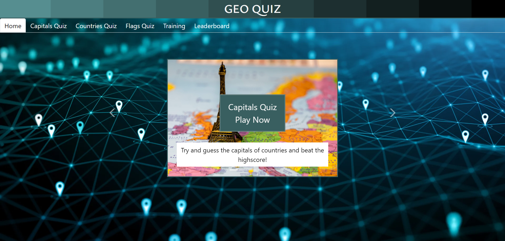

# lap1-project-frontend
# **Geo Quiz**

**Project description**

An app aim to improve learning engagement for secondary school students in non-STEM subjects.
Filled with quizzes, flash cards and leaderboards to make learning more fun and enjoyable.

**Installation & usage**
- Install npm
- Packages
    - watchify
    - live-server
    - cocurrently

**Technologies**
- bootstrap
- vscode

**Process**
- work as team
- planning 
- made MVP then change and improve it

